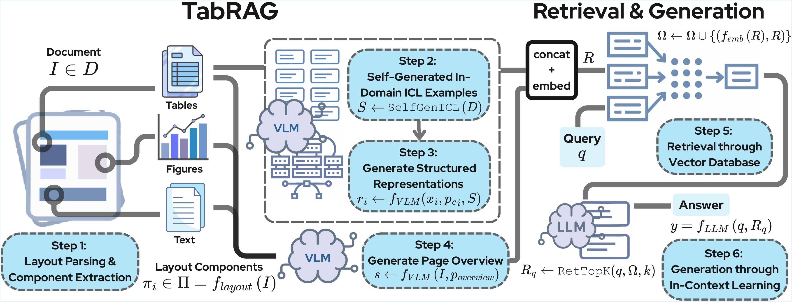

# TabRAG: Improving Tabular Document Question Answering for Retrieval Augmented Generation via Structured Representations
<div align="center">
<div>
    <a href="https://jacobyhsi.github.io/" target="_blank">Jacob Si</a><sup>1*</sup> | 
    <a href="https://mikequ1.github.io/" target="_blank">Mike Qu</a><sup>2*</sup> | 
    <a href="https://www.linkedin.com/in/michelle-lee-9a796712b/" target="_blank">Michelle Lee</a><sup>1</sup> | 
    <a href="https://www.marekrei.com/about/" target="_blank">Marek Rei</a><sup>1</sup> |
    <a href="http://yingzhenli.net/home/en/" target="_blank">Yingzhen Li</a><sup>1</sup>
</div>
<br>
<div>
    <sup>1</sup>Imperial College London <sup>2</sup>Columbia University
</div>
<br>
</div>

<p align="center">
<a href=""></a>
<a href="https://github.com/jacobyhsi/TabRAG/blob/main/LICENSE"></a>
</p>

<div align="center">
  
  <p><em>Figure 1: The TabRAG Architecture, a parsing-based RAG pipeline designed specifically for tables.</em>
</div>

## Installation
### Enviroment Installation. 

Clone this repository and navigate to it in your terminal. Create an environment using a preferred package manager.

Note: can replace `conda` with `uv`.

```
conda create --name tabrag python=3.10
conda activate tabrag
```

Installing Dependencies
```
pip install torch
pip install 'git+https://github.com/facebookresearch/detectron2.git' --no-build-isolation
pip install pymupdf
pip install faiss-gpu
pip install timm
pip install shapely
pip install qwen_vl_utils
pip install gdown
pip install opencv-python
pip install pypdf
pip install arxiv
pip install weasyprint
pip install datasets
pip install vllm
pip install sentence_transformers
pip install numpy==1.26.4
```

### Installing Tesseract OCR and PyTesseract (Optional - Baseline). 

This guide explains how to install Tesseract OCR and use it in Python via PyTesseract by building from source. Official build guide: https://tesseract-ocr.github.io/tessdoc/Compiling.html

1. Install Python OCR dependencies inside your project environment
```bash
pip install pytesseract Pillow
```

2. Create a build directory
```bash
mkdir -p $HOME/tesseract_build
cd $HOME/tesseract_build
```

3. Download 

Tesseract Source
```bash
git clone https://github.com/tesseract-ocr/tesseract.git
```

Leptonica Source
```bash
git clone https://github.com/DanBloomberg/leptonica.git
```

4. Build & install locally
```bash
cd $HOME/tesseract_build/leptonica
./autobuild
./configure --prefix=$HOME/tesseract_build/install
make -j$(nproc)
make install

cd ../tesseract
./autogen.sh
LIBLEPT_HEADERSDIR=$HOME/tesseract_build/install/include ./configure \
  --prefix=$HOME/tesseract_build/install \
  --with-extra-libraries=$HOME/tesseract_build/install/lib
make -j$(nproc)
make install
```

5. Verify installation
```bash
$HOME/tesseract_build/install/bin/tesseract --version
```

6. Set environment variable for running any OCR script
```bash
export PATH=$HOME/tesseract_build/install/bin:$PATH
export LD_LIBRARY_PATH=$HOME/tesseract_build/install/lib:$LD_LIBRARY_PATH
export TESSDATA_PREFIX=$HOME/tesseract_build/install/share/tessdata

which tesseract
tesseract --version
```

7. Download language data for tesseract to perform OCR
```bash
mkdir -p $HOME/tesseract_build/install/share/tessdata
cd $HOME/tesseract_build/install/share/tessdata
wget https://github.com/tesseract-ocr/tessdata_best/raw/main/eng.traineddata
```

### Layout Model 

Microsoft's DIT model (Document Image Transformer) is used for layout extraction: https://github.com/microsoft/unilm/tree/master/dit

Download this checkpoint: 
https://mail2sysueducn-my.sharepoint.com/:u:/g/personal/huangyp28_mail2_sysu_edu_cn/ESKnk2I_O09Em52V1xb2Ux0BrO_Z-7cuzL3H1KQRxipb7Q?e=iqTfGc

Move it to the project directory.

### Datasets
Enter the datasets/ folder

```
cd datasets
```

**TAT-DQA**:
```
mkdir tatdqa
cd tatdqa
gdown https://drive.google.com/uc?id=1iqe5r-qgQZLhGtM4G6LkNp9S6OCwOF2L
# unzip the folder
gdown https://drive.google.com/uc?id=1ZQjjIC0BB14l6t9b1Ryq0t-CNAP6iC2J

python process_tatdqa.py
```

**MP-DocVQA**:
```
wget https://datasets.cvc.uab.es/rrc/DocVQA/Task4/images.tar.gz --no-check-certificate
tar -xvf images.tar.gz
python process_mpdocvqa.py # get documents with tables # EDIT run this will do
# python filter_mpdocvqa.py # select 500 pages based on qa:pages ratio
# python indent_mpdocvqa.py # visibility of val.json
```

**SPIQA**:
```
# mkdir/cd into datasets/SPIQA
pip install arxiv

# open python shell: python
from huggingface_hub import snapshot_download
snapshot_download(repo_id="google/spiqa", repo_type="dataset", local_dir='.') ### Mention the local directory path

python process_spiqa.py
```

**WikiTableQuestions**:
```
wget https://github.com/ppasupat/WikiTableQuestions/archive/refs/tags/v1.0.2.tar.gz
tar -xvf v1.0.2.tar.gz
mv WikiTableQuestions-1.0.2 wikitablequestions
python process_wikitq.py
```

**FinTabNet**:
```
wget https://dax-cdn.cdn.appdomain.cloud/dax-fintabnet/1.0.0/fintabnet.tar.gz
tar -xvf fintabnet.tar.gz
```

### Run
Before running TabRAG, please serve a VLM, and an LLM. For example:

```
vllm serve "Qwen/Qwen3-VL-8B-Instruct" --dtype auto --tensor-parallel-size 1 --max_model_len 96000 --gpu-memory-utilization 0.95 --port 1707
```

Once the LMs are served, the ragstore can be constructed:
```
python main.py --model tabrag --mode generation --dataset tatdqa
```
