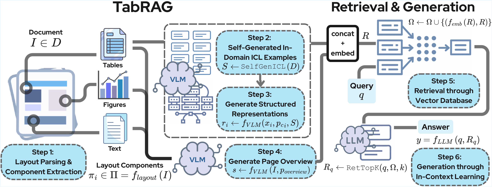

# TabRAG: Improving Tabular Document Question Answering for Retrieval Augmented Generation via Structured Representations
<div align="center">
<div>
    <a href="https://jacobyhsi.github.io/" target="_blank">Jacob Si</a><sup>1*</sup> | 
    <a href="https://mikequ1.github.io/" target="_blank">Mike Qu</a><sup>2*</sup> | 
    <a href="https://www.linkedin.com/in/michelle-lee-9a796718B/" target="_blank">Michelle Lee</a><sup>1</sup> | 
    <a href="https://www.marekrei.com/about/" target="_blank">Marek Rei</a><sup>1</sup> |
    <a href="http://yingzhenli.net/home/en/" target="_blank">Yingzhen Li</a><sup>1</sup>
</div>
<br>
<div>
    <sup>1</sup>Imperial College London <sup>2</sup>Columbia University
</div>
<br>
</div>

<p align="center">
<a href=""></a>
<a href="https://github.com/jacobyhsi/TabRAG/blob/main/LICENSE"></a>
</p>

<div align="center">
  
  <p><em>Figure 1: The TabRAG Architecture, a parsing-based RAG pipeline designed specifically for tables.</em>
</div>

## Installation
### Enviroment Installation. 

Clone this repository and navigate to it in your terminal. Create an environment using a preferred package manager.

Note: can replace `conda` with `uv`.

```
conda create --name tabrag python=3.10
conda activate tabrag
```

or

```
uv venv --python 3.10
source .venv/bin/activate
```

Installing Dependencies
```
pip install -r requirements.txt
pip uninstall torchcodec
```

or

```
uv pip install -r requirements.txt
uv pip uninstall torchcodec
```

<details>
<summary>Optional: Installing Tesseract OCR and PyTesseract</summary>

This guide explains how to install a baseline in our paper, Tesseract OCR, and use it in Python via PyTesseract by building from source. Official build guide: https://tesseract-ocr.github.io/tessdoc/Compiling.html

1. Install Python OCR dependencies inside your project environment
```
pip install pytesseract Pillow
```

2. Create a build directory
```
mkdir -p $HOME/tesseract_build
cd $HOME/tesseract_build
```

3. Download 

Tesseract Source
```
git clone https://github.com/tesseract-ocr/tesseract.git
```

Leptonica Source
```
git clone https://github.com/DanBloomberg/leptonica.git
```

4. Build & install locally
```
cd $HOME/tesseract_build/leptonica
./autobuild
./configure --prefix=$HOME/tesseract_build/install
make -j$(nproc)
make install

cd ../tesseract
./autogen.sh
LIBLEPT_HEADERSDIR=$HOME/tesseract_build/install/include ./configure \
  --prefix=$HOME/tesseract_build/install \
  --with-extra-libraries=$HOME/tesseract_build/install/lib
make -j$(nproc)
make install
```

5. Verify installation
```
$HOME/tesseract_build/install/bin/tesseract --version
```

6. Set environment variable for running any OCR script
```
export PATH=$HOME/tesseract_build/install/bin:$PATH
export LD_LIBRARY_PATH=$HOME/tesseract_build/install/lib:$LD_LIBRARY_PATH
export TESSDATA_PREFIX=$HOME/tesseract_build/install/share/tessdata

which tesseract
tesseract --version
```

7. Download language data for tesseract to perform OCR
```
mkdir -p $HOME/tesseract_build/install/share/tessdata
cd $HOME/tesseract_build/install/share/tessdata
wget https://github.com/tesseract-ocr/tessdata_best/raw/main/eng.traineddata
```
</details>

### Layout Model 

Microsoft's DiT model (Document Image Transformer) is used for layout extraction: https://github.com/microsoft/unilm/tree/master/dit

Download the DiT-Large checkpoint pretrained on the Publaynet Dataset:

```
wget --continue -O publaynet_dit-l_cascade.pth "https://huggingface.co/HYPJUDY/dit/resolve/main/dit-fts/publaynet_dit-l_cascade.pth"
```

or

```
gdown "https://drive.google.com/uc?id=1whISKAO851EA0229cPCfo-eO5IVKzybT" -O publaynet_dit-l_cascade.pth
```

Move it to the project directory TabRAG/.

### Datasets

Download the dataset.zip from Google Drive then unzip it.

```
gdown 
gdown "https://drive.google.com/uc?id=1zAp8KZrtnMtZceUFdHG5yq64argd_uNF" -O datasets.zip
```

Note that for new datasets, please convert all PDFs into single-page images then organize them as follows:

```
datasets/
├── {dataset_name}/
│   ├── retrieval
|   |   ├── {folder1_name} # all page images in this folder are treated as the same "document"
|   |   |   ├── page0.jpg
|   |   |   ├── page1.jpg
|   |   |   ├── ......
```


### Build Ragstore
To build a Ragstore, we can choose between using an externally-served VLM using VLLM, or using a provider like HuggingFace directly.

To serve a VLM externally:
```
vllm serve "Qwen/Qwen3-VL-8B-Instruct" --dtype auto --tensor-parallel-size 1 --max_model_len 96000 --gpu-memory-utilization 0.95 --port 2222
```

The first step involves construct the Self-Generated ICL examples. Depending on whether you choose to use HuggingFace or VLLM:
```
python generate_icl.py --model Qwen/Qwen3-VL-8B-Instruct --dataset tatdqa --use_hf
```
```
python generate_icl.py --model Qwen/Qwen3-VL-8B-Instruct --dataset tatdqa --use_vllm --vllm_ip localhost --vllm_port 2222
```

Afterwards, we can generate the TabRAG rationales and build the vector databases for downstream retrieval:
```
python main.py --model tabrag --mode generation --dataset tatdqa --vlm Qwen/Qwen3-VL-8B-Instruct --embedder Qwen/Qwen3-Embedding-8B --use_hf
```
```
python main.py --model tabrag --mode generation --dataset tatdqa --vlm Qwen/Qwen3-VL-8B-Instruct --embedder Qwen/Qwen3-Embedding-8B --use_vllm --vllm_ip localhost --vllm_port 2222
```

### Query Engine
After constructing the vector database, we can perform queries to receive responses grounded in retrieved documents.

For inference, we can choose between using an externally-served VLM using VLLM, OpenAI's models, or a provider like HuggingFace directly.

To serve a LLM externally:
```
vllm serve "Qwen/Qwen3-8B" --dtype auto --tensor-parallel-size 1 --max_model_len 96000 --gpu-memory-utilization 0.95 --port 2222
```
Now, we can perform queries using the below commands, depending on the LLM inference provider
```
python inference.py --data_path "storages/[path_to_ragstore]" --embedder Qwen/Qwen3-Embedding-4B --model gpt-5-mini --use_openai
```
```
python inference.py --data_path "storages/[path_to_ragstore]" --embedder Qwen/Qwen3-Embedding-4B --model Qwen/Qwen3-8B --use_hf
```
```
python inference.py --data_path "storages/[path_to_ragstore]" --embedder Qwen/Qwen3-Embedding-4B --model Qwen/Qwen3-8B --use_hf --vllm_ip localhost --vllm_port 2222
```
